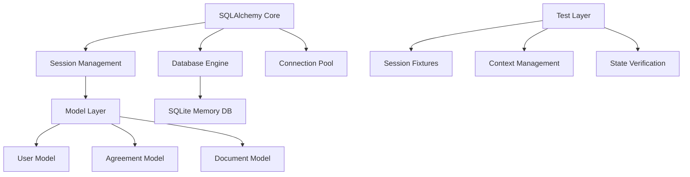
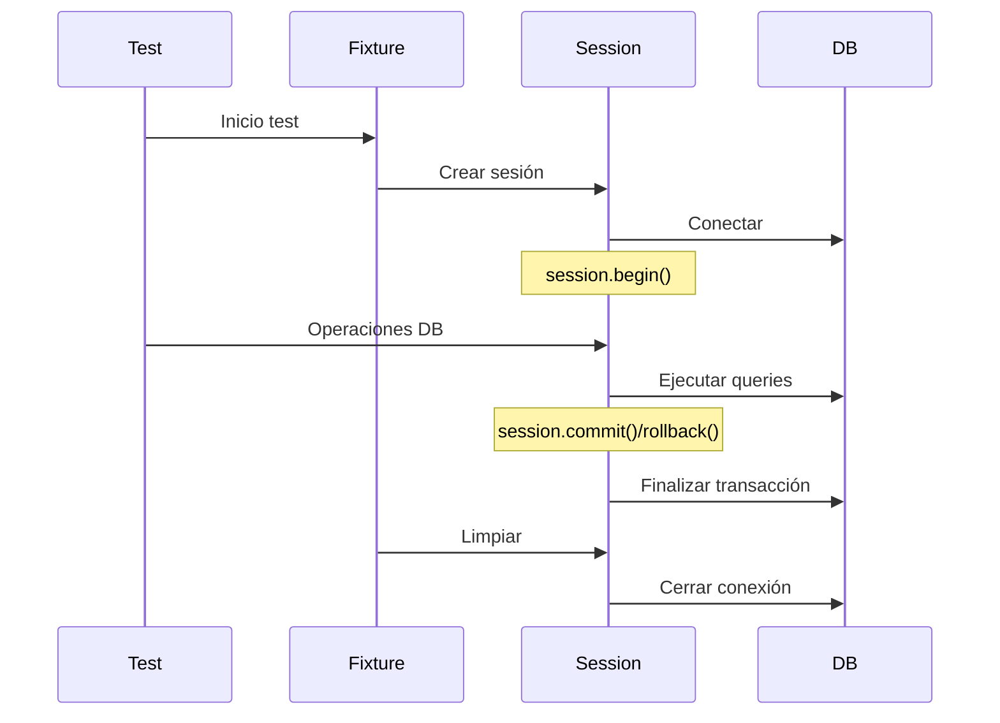
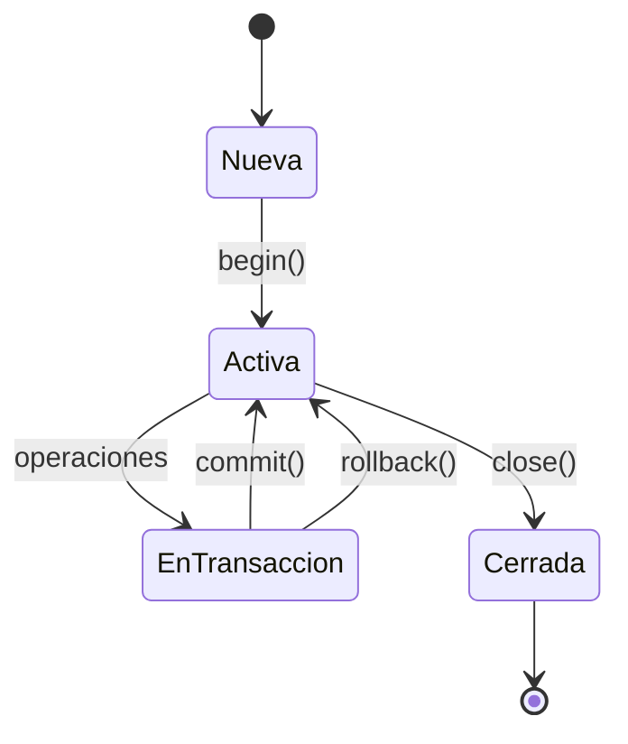

# Arquitectura SQLAlchemy en Split Sheet

## 1. Estructura de Componentes



## 2. Gestión de Sesiones

### 2.1 Jerarquía de Sesiones
- Base Session Factory (models/database.py)
- Scoped Session para tests (tests/conftest.py)
- Session por request (main.py)

### 2.2 Ciclo de Vida de Sesión


## 3. Puntos Críticos

### 3.1 Estado de Transacciones
```python
# Verificación correcta de transacción activa
transaction_active = (
    hasattr(session, '_transaction') and 
    session._transaction is not None and 
    session._transaction.is_active
)
```

### 3.2 Limpieza de Sesión
1. Rollback de transacciones pendientes
2. Expunge de objetos
3. Commit de cambios necesarios
4. Cierre de sesión
5. Remoción del registro
6. Disposición del pool

## 4. Fixtures Principales

### 4.1 Session Management
- `db_session`: Manejo principal de sesiones
- `verify_sqlalchemy_state`: Verificación de estado
- `cleanup_sqlalchemy`: Limpieza exhaustiva

### 4.2 Context Management
- `base_app_context`: Contexto base
- `verify_context_state`: Verificación de contextos
- `cleanup_contexts`: Limpieza de contextos

## 5. Puntos de Mejora

### 5.1 Problemas Detectados
- Transacciones que permanecen activas
- Objetos no liberados
- Contextos residuales

### 5.2 Soluciones Implementadas
- Verificación exhaustiva de estado
- Limpieza proactiva
- Assertions de validación

## 6. Referencias de Implementación

### 6.1 Estructura de Archivos
```
models/
  ├── database.py     # Core SQLAlchemy setup
  ├── base.py        # Modelo base
  ├── user.py        # User model
  └── agreement.py   # Agreement model
tests/
  ├── conftest.py    # Test fixtures
  └── test_database.py # DB tests
```

### 6.2 Flujo de Sesiones

