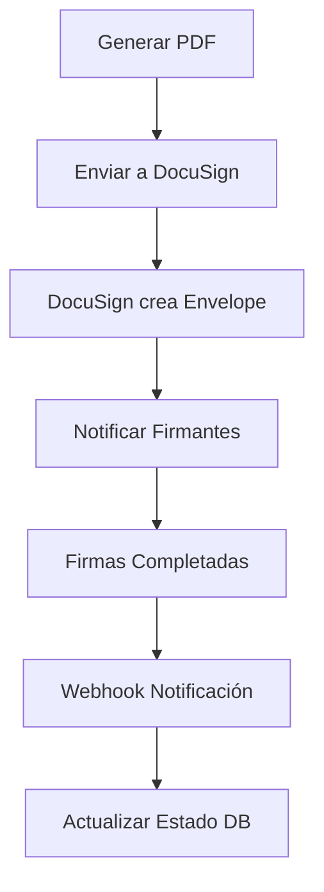

# Plan de Integración con DocuSign

## 1. Resumen Ejecutivo
La integración con DocuSign permitirá que los acuerdos de Split Sheet generados en PDF sean firmados digitalmente por todos los participantes, garantizando la validez legal del documento y simplificando el proceso de firma.

## 2. Flujo de Integración



### 2.1 Estado Actual
- ✓ Autenticación OAuth 2.0 con PKCE
- ✓ Generación y envío de documentos
- ✓ Validación HMAC de webhooks
- ✓ Manejo de estados de firma

### 2.2 Mejoras Implementadas
- Validación robusta de datos de entrada
- Manejo diferenciado de errores HTTP
- Tests unitarios y de integración
- Logging detallado

### 2.3 Proceso Detallado
1. API genera PDF del acuerdo
2. Se envía a DocuSign API usando OAuth 2.0
3. DocuSign crea un envelope y envía notificaciones
4. Los participantes firman usando DocuSign
5. DocuSign notifica mediante webhook
6. API actualiza el estado en la base de datos

## 3. Configuración

### 3.1 Variables Requeridas
```python
DOCUSIGN_CONFIG = {
    'INTEGRATION_KEY': 'Configurado',
    'CLIENT_SECRET': 'Configurado',
    'HMAC_KEY': 'Configurado',
    'ACCOUNT_ID': 'Configurado',
    'AUTH_SERVER': 'account-d.docusign.com',
    'REDIRECT_URI': 'http://localhost:5000/api/callback'
}
```

### 3.2 Estado de Tests
- ✓ Test de autenticación OAuth
- ✓ Test de validación HMAC
- ✓ Test de callbacks
- ✓ Test de estados de documento

## 4. Nuevos Endpoints

### 4.1 POST /api/docusign/send
```json
{
    "document_id": "split_123",
    "signers": [
        {
            "name": "Juan Pérez",
            "email": "juan@ejemplo.com",
            "role": "Compositor"
        },
        {
            "name": "María García",
            "email": "maria@ejemplo.com",
            "role": "Productor"
        }
    ],
    "message": "Por favor firmar el acuerdo de Split Sheet"
}
```

### 4.2 GET /api/docusign/status/{envelope_id}
```json
{
    "envelope_id": "123-456-789",
    "status": "completed",
    "signers": [
        {
            "name": "Juan Pérez",
            "email": "juan@ejemplo.com",
            "status": "signed",
            "signed_at": "2024-03-13T15:30:00Z"
        }
    ]
}
```

### 4.3 POST /api/docusign/webhook
Endpoint para recibir notificaciones de DocuSign sobre cambios de estado.

## 5. Implementación

### 5.1 Servicio de DocuSign
```python
class DocuSignService:
    def __init__(self):
        self.api_client = ApiClient()
        self.account_id = current_app.config['DOCUSIGN_ACCOUNT_ID']
        self._configure_jwt_auth()
    
    def send_for_signature(self, document_id, signers):
        envelope_definition = self._create_envelope(document_id, signers)
        envelope_api = EnvelopesApi(self.api_client)
        return envelope_api.create_envelope(self.account_id, envelope_definition)
```

## 6. Plan de Pruebas

### 6.1 Pruebas Unitarias
```python
def test_docusign_send():
    service = DocuSignService()
    response = service.send_for_signature(
        document_id="test_123",
        signers=[{"name": "Test User", "email": "test@test.com"}]
    )
    assert response.status == "sent"
```

### 6.2 Pruebas de Integración
1. Generar PDF de prueba
2. Enviar a DocuSign Sandbox
3. Verificar recepción de emails
4. Completar proceso de firma
5. Verificar webhook
6. Validar estados en base de datos

## 7. Seguridad

### 7.1 Consideraciones
- Almacenar claves privadas de forma segura
- Validar webhooks con DocuSign
- Verificar permisos de usuarios
- Encriptar datos sensibles

### 7.2 Validación de Webhook
```python
def validate_docusign_webhook(request):
    signature = request.headers.get('X-DocuSign-Signature-1')
    return docusign_hmac.verify(
        request.data,
        signature,
        current_app.config['DOCUSIGN_HMAC_KEY']
    )
```

## 8. Monitoreo y Logs

### 8.1 Eventos a Registrar
- Envíos de documentos
- Cambios de estado
- Errores de API
- Webhooks recibidos
- Firmas completadas

### 8.2 Formato de Logs
```python
{
    "event": "docusign.envelope.sent",
    "envelope_id": "123-456-789",
    "document_id": "split_123",
    "timestamp": "2024-03-13T15:30:00Z",
    "status": "sent",
    "user_id": "user_123"
}
```

## 9. Plan de Rollout

### 9.1 Fases
1. Desarrollo y pruebas en sandbox
2. Beta con usuarios seleccionados
3. Implementación gradual
4. Monitoreo y ajustes
5. Rollout completo

### 9.2 Criterios de Éxito
- 100% de pruebas pasando
- Tiempo de respuesta < 2s
- Tasa de error < 1%
- Firmas completadas exitosamente
