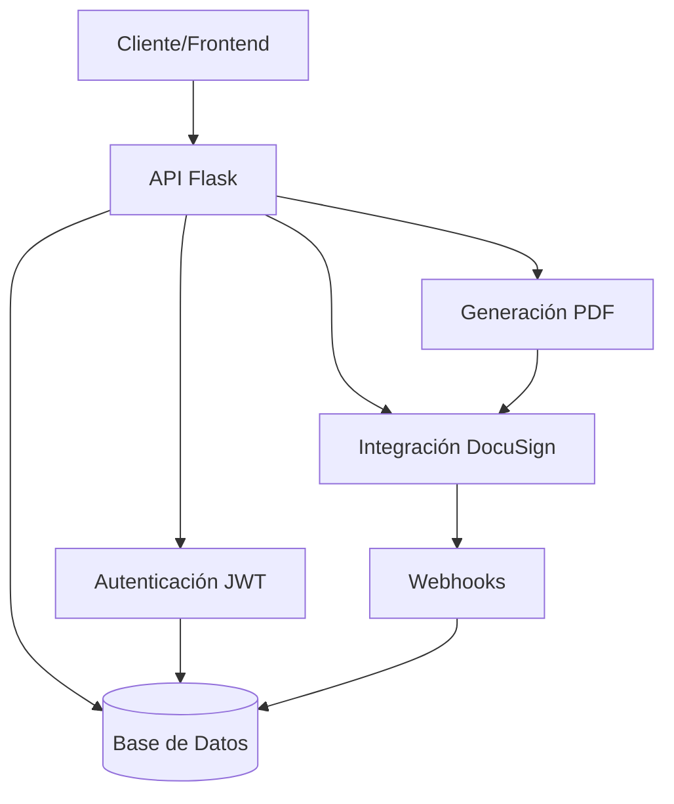

# Visión General del Sistema

## Arquitectura de Split Sheet Backend

Split Sheet Backend es una API REST desarrollada con Flask que implementa una arquitectura modular. Su propósito principal es gestionar documentos de reparto de derechos musicales ("Split Sheets") y facilitar su firma digital mediante la integración con DocuSign.

### Diagrama de Arquitectura

## Componentes Principales

### 1. API REST (Flask)
- Implementada con Flask 2.0.1
- Patrón Blueprint para organización modular
- Endpoints documentados y con validación exhaustiva
- Manejo de errores consistente

### 2. Base de Datos (SQLAlchemy)
- ORM SQLAlchemy 1.4.31
- Modelos: User, Agreement, Document
- Migraciones con Flask-Migrate
- SQLite en desarrollo, PostgreSQL planificado para producción

### 3. Autenticación (JWT)
- Gestión de tokens con Flask-JWT-Extended
- Blacklisting de tokens en logout
- Validación de contraseñas segura
- Protección de endpoints sensibles

### 4. Generación de PDF (ReportLab)
- Creación dinámica de documentos
- Formato personalizable
- Validación exhaustiva de datos de entrada
- Integración con flujo de firma

### 5. Integración DocuSign
- Autenticación OAuth 2.0 con PKCE
- JWT para comunicación con API DocuSign
- Envío de documentos para firma
- Procesamiento de webhooks para actualización de estados

## Flujo de Operaciones

### Generación y Firma de Split Sheet
1. Usuario se autentica y obtiene token JWT
2. Cliente envía datos del acuerdo a `/api/pdf/generate_pdf`
3. Sistema valida los datos y genera PDF
4. PDF se envía a DocuSign mediante `/api/docusign/send_for_signature`
5. DocuSign procesa firmas y envía notificaciones vía webhook
6. Sistema actualiza estado del documento

### Manejo de Sesiones DocuSign
1. Usuario inicia flujo de autorización vía `/api/docusign/auth`
2. Sistema genera code_verifier/challenge y redirige a DocuSign
3. Usuario autoriza la aplicación en DocuSign
4. DocuSign redirige a `/api/docusign/callback` con código de autorización
5. Sistema intercambia código por tokens de acceso/refresh
6. Tokens se almacenan y se utilizan para operaciones futuras

## Aspectos Técnicos

### Manejo de Contextos Flask
- Gestión cuidadosa de contextos de aplicación
- Limpieza automática en tests
- Prevención de memory leaks

### Gestión de Sesiones SQLAlchemy
- Sesiones con scope controlado
- Patrón session_scope para transacciones atómicas
- Diagnóstico de sesiones activas

### Testing
- Más de 95% de cobertura
- Tests unitarios e integración
- Fixtures para setup/teardown consistente
- Diagnóstico automático de problemas

## Próximas Mejoras
- Migración a PostgreSQL
- Implementación de rate limiting
- Caché Redis para tokens
- Sistema de monitoreo en tiempo real
