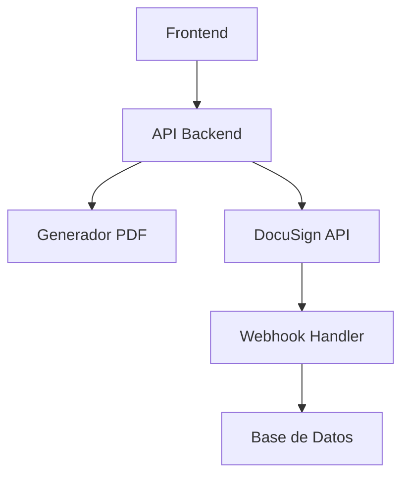

# Plan de Integración PDF-DocuSign para Split Sheet

## 1. Objetivos

### 1.1 Objetivo Principal
Implementar un sistema completo de generación y firma digital de documentos que integre:
- Generación de PDF usando ReportLab
- Firma digital mediante DocuSign
- Seguimiento del estado de firmas
- Validación de documentos

### 1.2 Alcance
- Generación automática de Split Sheets en PDF
- Integración con DocuSign API v2.1
- Sistema de seguimiento de estados
- Validación HMAC para webhooks
- Tests automatizados

## 2. Arquitectura de la Solución

### 2.1 Componentes Principales


### 2.2 Flujo de Datos
1. Cliente solicita generación de Split Sheet
2. Sistema genera PDF usando ReportLab
3. PDF se envía a DocuSign
4. DocuSign notifica cambios vía webhook
5. Sistema actualiza estado en DB

## 3. Plan de Implementación

### 3.1 Fase 1: Generación de PDF
**Duración**: 3 días

```python
from reportlab.lib.pagesizes import letter
from reportlab.pdfgen import canvas

class PDFGenerator:
    def generate_split_sheet(self, data):
        # Configuración del documento
        pdf = canvas.Canvas("split_sheet.pdf", pagesize=letter)
        
        # Título y metadata
        pdf.setTitle(f"Split Sheet - {data['title']}")
        
        # Contenido
        self._add_header(pdf, data)
        self._add_participants(pdf, data['participants'])
        self._add_signature_blocks(pdf, data['participants'])
        
        return pdf.getpdfdata()
```

### 3.2 Fase 2: Integración DocuSign
**Duración**: 4 días

#### 2.1 Configuración OAuth 2.0
```python
class DocuSignConfig:
    AUTH_SERVER = 'account-d.docusign.com'
    SCOPE = 'signature impersonation'
    CALLBACK_PATH = '/api/callback'
```

#### 2.2 Envío de Documentos
```python
class DocuSignService:
    def send_for_signature(self, pdf_data, recipients):
        envelope = self._create_envelope(pdf_data, recipients)
        return self.api.envelopes.create(envelope)
```

### 3.3 Fase 3: Webhooks y Estados
**Duración**: 3 días

#### 3.1 Configuración Webhook
```python
@bp.route('/docusign/webhook', methods=['POST'])
def webhook_handler():
    validator = DocuSignHMACValidator()
    validator.validate_or_abort(request)
    
    event = request.json
    envelope_id = event['envelopeId']
    update_document_status(envelope_id, event['status'])
```

### 3.4 Fase 4: Pruebas y Validación
**Duración**: 5 días

#### 4.1 Tests Unitarios
```python
def test_pdf_generation():
    generator = PDFGenerator()
    data = {
        'title': 'Test Song',
        'participants': [
            {'name': 'John Doe', 'role': 'Composer', 'share': 50}
        ]
    }
    pdf_data = generator.generate_split_sheet(data)
    assert pdf_data is not None
```

## 4. Configuración de Seguridad

### 4.1 Autenticación
- OAuth 2.0 con PKCE para DocuSign
- JWT para API endpoints
- HMAC para validación de webhooks

### 4.2 Manejo de Claves
```python
DOCUSIGN_CONFIG = {
    'private_key_path': 'private.key',
    'hmac_key': os.getenv('DOCUSIGN_HMAC_KEY'),
    'integration_key': os.getenv('DOCUSIGN_INTEGRATION_KEY')
}
```

## 5. Monitoreo y Logging

### 5.1 Eventos a Registrar
- Generación de PDF
- Envío a DocuSign
- Actualización de estados
- Errores y excepciones

### 5.2 Formato de Logs
```python
log_format = {
    'timestamp': 'ISO-8601',
    'level': 'INFO/ERROR',
    'event_type': 'pdf.generation|docusign.sent|status.update',
    'details': {}
}
```

## 6. Cronograma Detallado

| Semana | Actividades | Entregables |
|--------|-------------|-------------|
| 1 | Configuración inicial, PDF | Generador PDF |
| 2 | DocuSign OAuth, Envío | Integración DocuSign |
| 3 | Webhooks, Estados | Sistema de estados |
| 4 | Pruebas, Documentación | Tests, Docs |

## 7. Métricas de Éxito

### 7.1 Funcionales
- Tiempo de generación PDF < 2s
- Tasa de éxito en firmas > 95%
- Tiempo de actualización estado < 1s

### 7.2 No Funcionales
- Cobertura de tests > 90%
- Tiempo de respuesta API < 500ms
- Disponibilidad > 99.9%

## 8. Plan de Rollback

### 8.1 Procedimientos
1. Backup de base de datos
2. Versionado de documentos
3. Sistema de logs detallado
4. Scripts de reversión

## 9. Próximos Pasos

### 9.1 Inmediatos
1. [ ] Configurar entorno desarrollo
2. [ ] Implementar generador PDF
3. [ ] Configurar DocuSign

### 9.2 Futuros
1. [ ] Optimización de rendimiento
2. [ ] Métricas en tiempo real
3. [ ] Dashboard de administración
