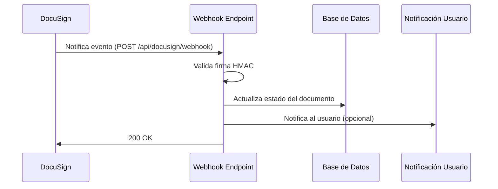

# Webhooks de DocuSign

## Visión General

Los webhooks permiten a DocuSign notificar automáticamente a nuestra aplicación sobre eventos importantes, como cuando un documento ha sido firmado, entregado o rechazado. Esta implementación asíncrona elimina la necesidad de sondear constantemente la API de DocuSign.

## Flujo de Funcionamiento



## Configuración en DocuSign

### Pasos para Configurar Webhooks

1. Iniciar sesión en la [consola de desarrollador de DocuSign](https://admindemo.docusign.com)
2. Navegar a **Settings > Connect**
3. Hacer clic en **Add Configuration**
4. Configurar los siguientes parámetros:
   - **Name**: Split Sheet Webhook
   - **URL**: `https://yourdomain.com/api/docusign/webhook`
   - **Authentication**: HMAC
   - **Secret Key**: La misma clave configurada en `DOCUSIGN_HMAC_KEY`
   - **Include HMAC Signature**: Activado

### Eventos a Suscribir

Seleccionar los siguientes eventos para ser notificados:

- **Envelope Events**:
  - Envelope Sent
  - Envelope Delivered
  - Envelope Completed
  - Envelope Declined
  - Envelope Voided

- **Recipient Events**:
  - Recipient Completed
  - Recipient Declined
  - Recipient Authentication Failed

## Implementación del Endpoint

### Validación HMAC

DocuSign firma cada solicitud webhook con un HMAC basado en el secreto compartido. Es crucial validar esta firma antes de procesar el evento:

```python
class DocuSignHMACValidator:
    def __init__(self, hmac_key):
        self.hmac_key = hmac_key.encode('utf-8')
    
    def validate_request(self, request):
        """Valida la firma HMAC de la solicitud."""
        # Obtener la firma del encabezado
        signature = request.headers.get('X-DocuSign-Signature-1')
        if not signature:
            return False
        
        # Obtener el cuerpo de la solicitud
        body = request.get_data()
        
        # Calcular el HMAC-SHA256 del cuerpo
        expected_hmac = hmac.new(
            self.hmac_key,
            body,
            hashlib.sha256
        ).digest()
        
        # Comparar con la firma recibida (decodificada de base64)
        try:
            received_hmac = base64.b64decode(signature)
            # Comparación segura (resistente a timing attacks)
            return hmac.compare_digest(expected_hmac, received_hmac)
        except Exception as e:
            current_app.logger.error(f"Error validando firma HMAC: {str(e)}")
            return False
```

### Endpoint Webhook

```python
@docusign_bp.route('/webhook', methods=['POST'])
def docusign_webhook():
    """
    Procesa notificaciones webhook de DocuSign.
    
    La firma HMAC se verifica para garantizar que la solicitud proviene de DocuSign.
    """
    # Validar HMAC
    validator = DocuSignHMACValidator(current_app.config['DOCUSIGN_HMAC_KEY'])
    if not validator.validate_request(request):
        current_app.logger.warning("Recibida solicitud webhook con firma HMAC inválida")
        return jsonify({"error": "Firma inválida"}), 401
    
    # Procesar evento
    try:
        data = request.get_json()
        if not data:
            return jsonify({"error": "Datos JSON no válidos"}), 400
        
        # DocuSign debe proporcionar al menos estos datos
        if 'event' not in data or 'envelopeId' not in data:
            return jsonify({"error": "Datos incompletos"}), 400
        
        event_type = data['event']
        envelope_id = data['envelopeId']
        
        # Registrar el evento recibido
        current_app.logger.info(f"Webhook DocuSign recibido: {event_type} para envelope {envelope_id}")
        
        # Actualizar estado del documento en la base de datos
        document = get_document_by_envelope(envelope_id)
        if document:
            # Mapeo de eventos DocuSign a estados internos
            status_mapping = {
                'envelope-sent': 'sent',
                'envelope-delivered': 'delivered',
                'envelope-completed': 'completed',
                'envelope-declined': 'declined',
                'envelope-voided': 'voided'
            }
            
            # Actualizar estado si corresponde
            new_status = status_mapping.get(event_type)
            if new_status:
                document.status = new_status
                document.updated_at = datetime.utcnow()
                db.session.commit()
                
                # Opcionalmente, notificar al usuario
                notify_document_status_change(document)
        else:
            current_app.logger.warning(f"Recibido evento para envelope desconocido: {envelope_id}")
        
        return jsonify({"status": "success", "message": "Evento procesado correctamente"})
        
    except Exception as e:
        current_app.logger.error(f"Error procesando webhook: {str(e)}")
        return jsonify({"error": "Error interno", "details": str(e)}), 500
```

## Pruebas y Depuración

### Simulación de Webhooks Localmente

Para desarrollar y probar localmente, puedes usar herramientas como [ngrok](https://ngrok.com/) para exponer tu servidor local a Internet:

```bash
# Iniciar ngrok en el puerto donde se ejecuta tu aplicación Flask
ngrok http 5000
```

Esto creará un túnel seguro a tu servidor local. Usa la URL proporcionada por ngrok como URL de webhook en DocuSign.

### Verificación Manual

Para verificar que tu endpoint funciona correctamente, puedes enviar una solicitud POST con Postman o curl, asegurándote de incluir un encabezado `X-DocuSign-Signature-1` válido.

### Logging para Depuración

Implementa logging detallado en el endpoint webhook para facilitar la depuración:

```python
@docusign_bp.route('/webhook', methods=['POST'])
def docusign_webhook():
    # Registrar encabezados para depuración
    current_app.logger.debug(f"Encabezados recibidos: {dict(request.headers)}")
    
    # Registrar cuerpo raw para depuración
    current_app.logger.debug(f"Cuerpo recibido: {request.get_data(as_text=True)[:200]}...")
    
    # Resto del código...
```

## Gestión de Estados de Documento

### Estados de Documento

| Estado DocuSign | Estado Interno | Descripción |
|----------------|----------------|-------------|
| envelope-created | draft | Envelope creado pero no enviado |
| envelope-sent | sent | Envelope enviado a los firmantes |
| envelope-delivered | delivered | Envelope entregado a los firmantes |
| envelope-completed | completed | Todos los firmantes han completado la firma |
| envelope-declined | declined | Al menos un firmante ha rechazado firmar |
| envelope-voided | voided | El envelope ha sido anulado |

### Actualización de UI

Cuando se recibe un webhook, además de actualizar la base de datos, puede ser necesario actualizar la UI del usuario:

1. **Notificaciones en tiempo real**: Implementar WebSockets o Server-Sent Events
2. **Emails**: Enviar notificaciones por email cuando cambia el estado del documento
3. **Panel de control**: Actualizar automáticamente el panel de control del usuario

## Seguridad

### Best Practices

1. **Validación HMAC**: Siempre validar la firma HMAC para verificar que la solicitud proviene de DocuSign
2. **HTTPS**: Asegurar que el endpoint webhook use HTTPS en producción
3. **Idempotencia**: Asegurar que procesar el mismo evento varias veces no cause problemas
4. **Timeout**: Responder a DocuSign dentro del límite de tiempo esperado (evitar operaciones largas durante el procesamiento)
5. **Firewall**: Configurar reglas de firewall para aceptar solicitudes solo desde las IPs de DocuSign

### Troubleshooting

Si los webhooks no funcionan correctamente:

1. Verificar configuración de URL webhook en DocuSign
2. Confirmar que la clave HMAC es la misma en DocuSign y en el código
3. Revisar logs para errores de validación HMAC
4. Comprobar que el servidor sea accesible desde Internet
5. Verificar que DocuSign pueda resolver el dominio y conectarse al puerto configurado

## Referencias

- [Documentación oficial de DocuSign sobre Connect](https://developers.docusign.com/platform/webhooks/)
- [Guía de seguridad para webhooks](https://developers.docusign.com/platform/webhooks/connect-hmac/)
