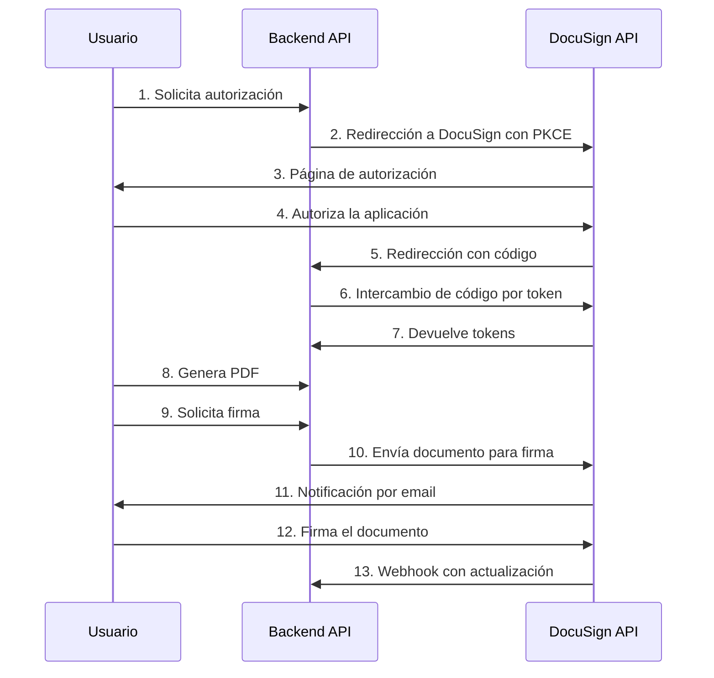

# Flujo de Trabajo con DocuSign

## Visión General

Este documento describe el flujo completo de integración con DocuSign, desde la autenticación hasta el envío de documentos para firma y el procesamiento de los webhooks.

## Arquitectura de la Integración



## Flujo de Autorización OAuth 2.0 con PKCE

### 1. Inicio del Flujo (`/api/docusign/auth`)

Cuando un usuario accede a `/api/docusign/auth`, el sistema:

1. Genera un `code_verifier` aleatorio (valor criptográficamente seguro)
2. Calcula el `code_challenge` (hash SHA-256 del verifier, codificado en base64url)
3. Almacena el `code_verifier` y un `state` aleatorio en la sesión del usuario
4. Redirige al usuario a DocuSign con los parámetros necesarios

```python
@docusign_bp.route('/auth', methods=['GET'])
def docusign_auth():
    # Generar y almacenar code_verifier y state
    code_verifier, code_challenge = DocuSignPKCE.generate_pkce_pair()
    
    # Generar URL de autorización
    auth_url = docusign_service.generate_auth_url(
        scope='signature',
        response_type='code'
    )
    
    # Redirigir al usuario
    return redirect(auth_url)
```

### 2. Autorización en DocuSign

El usuario ve la pantalla de autorización de DocuSign y decide si permite que la aplicación acceda a su cuenta.

### 3. Callback (`/api/docusign/callback`)

Después de que el usuario autoriza (o deniega) la aplicación, DocuSign redirige de vuelta a la URL de callback:

1. Se recibe el código de autorización y el state
2. Se valida que el state coincida con el almacenado (prevención CSRF)
3. Se recupera el `code_verifier` de la sesión
4. Se intercambia el código + verifier por tokens de acceso
5. Se almacenan los tokens para uso futuro

```python
@docusign_bp.route('/callback', methods=['GET'])
def docusign_callback():
    # Extraer código y state
    auth_code = request.args.get('code')
    state = request.args.get('state')
    
    # Validar state (anti-CSRF)
    stored_state = session.get('docusign_state')
    if state != stored_state:
        return jsonify({"error": "Estado inválido"})
    
    # Recuperar code_verifier
    code_verifier = session.get('docusign_code_verifier')
    
    # Intercambiar código por token
    tokens = docusign_service.exchange_code_for_token(
        auth_code, code_verifier
    )
    
    # Almacenar tokens
    session['docusign_access_token'] = tokens.get('access_token')
    
    # Redirigir a dashboard o devolver éxito
    return redirect('/dashboard')
```

## Envío de Documentos para Firma

### 1. Preparación del PDF

El documento debe generarse antes de enviarse para firma:

```python
@api_bp.route('/pdf/generate_pdf', methods=['POST'])
@jwt_required()
def generate_pdf():
    # Validar datos
    data = request.get_json()
    
    # Generar PDF
    pdf_buffer = generate_pdf_from_data(data)
    
    # Devolver el PDF
    return send_file(pdf_buffer, mimetype='application/pdf', as_attachment=True, attachment_filename="output.pdf")
```

### 2. Enviar para Firma

Una vez generado el PDF, puede enviarse a DocuSign para recolectar firmas:

```python
@docusign_bp.route('/send_for_signature', methods=['POST'])
@jwt_required()
def send_for_signature():
    data = request.get_json()
    
    # Obtener PDF (ya generado)
    pdf_bytes = get_document_bytes(data['document_id'])
    
    # Preparar destinatarios
    recipients = [{
        'email': data['recipient_email'],
        'name': data['recipient_name']
    }]
    
    # Enviar a DocuSign
    result = docusign_service.send_document_for_signature(
        pdf_bytes, recipients
    )
    
    # Almacenar información del envelope
    update_document_status(
        document_id=data['document_id'],
        envelope_id=result['envelope_id'],
        status=result['status']
    )
    
    return jsonify({
        'status': 'success',
        'data': result
    })
```

## Manejo de Webhooks

### 1. Configuración de Webhook

En el dashboard de DocuSign, configure un webhook para recibir notificaciones en:
```
https://your-domain.com/api/docusign/webhook
```

Seleccione los eventos a recibir:
- `envelope-sent`
- `envelope-delivered`
- `envelope-completed`
- `envelope-declined`
- `recipient-completed`

### 2. Procesamiento de Webhook

Cuando ocurra un evento en DocuSign, enviará una notificación a su endpoint:

```python
@docusign_bp.route('/webhook', methods=['POST'])
def docusign_webhook():
    # Validar firma HMAC
    validator = DocuSignHMACValidator(current_app.config['DOCUSIGN_HMAC_KEY'])
    is_valid = validator.validate_request(request)
    
    if not is_valid:
        return jsonify({"error": "Firma inválida"}), 401
    
    # Procesar evento
    data = request.get_json()
    envelope_id = data['envelopeId']
    status = data['status']
    
    # Actualizar estado del documento
    document = get_document_by_envelope(envelope_id)
    if document:
        document.status = status
        document.updated_at = datetime.utcnow()
        db.session.commit()
    
    return jsonify({"status": "success"})
```

## Verificación de Estado

### Consulta de Estado de Firma

Para verificar el estado actual de un documento enviado para firma:

```python
@docusign_bp.route('/signature_status/<envelope_id>', methods=['GET'])
@jwt_required()
def check_signature_status(envelope_id):
    # Obtener documento
    document = get_document_by_envelope(envelope_id)
    if not document:
        return jsonify({"error": "Documento no encontrado"}), 404
    
    # Verificar permisos
    current_user_id = get_jwt_identity()
    if document.user_id != current_user_id:
        return jsonify({"error": "No autorizado"}), 403
    
    # Consultar estado en DocuSign para actualización
    docusign_service = DocuSignService()
    status = docusign_service.get_signature_status(envelope_id)
    
    # Actualizar estado en base de datos si cambió
    if status['status'] != document.status:
        document.status = status['status']
        document.updated_at = datetime.utcnow()
        db.session.commit()
    
    return jsonify({
        "document_id": document.id,
        "title": document.title,
        "status": document.status,
        "envelope_id": envelope_id,
        "updated_at": document.updated_at.isoformat()
    })
```

## Manejo de Tokens

### Renovación Automática

Los tokens de acceso DocuSign expiran después de un tiempo. El sistema puede renovarlos automáticamente usando el refresh token:

```python
def get_access_token():
    """Obtiene un token válido, renovándolo si es necesario."""
    # Verificar si hay token en sesión/base de datos
    access_token = current_user.docusign_access_token
    expires_at = current_user.docusign_token_expires
    
    # Si no hay token o está expirado
    if not access_token or datetime.utcnow() >= expires_at:
        # Renovar usando refresh token
        if current_user.docusign_refresh_token:
            tokens = docusign_service.refresh_access_token(
                current_user.docusign_refresh_token
            )
            
            # Actualizar tokens en base de datos
            current_user.docusign_access_token = tokens['access_token']
            current_user.docusign_refresh_token = tokens['refresh_token']
            current_user.docusign_token_expires = datetime.utcnow() + 
                timedelta(seconds=tokens['expires_in'])
            db.session.commit()
            
            return tokens['access_token']
        else:
            # Redirigir a autorización
            raise ValueError("Requiere autorización con DocuSign")
    
    return access_token
```

## Buenas Prácticas

### Seguridad

1. **Protección CSRF**: El parámetro `state` previene ataques CSRF en el flujo OAuth
2. **PKCE**: Protege contra interceptación del código de autorización
3. **Validación HMAC**: Verifica que los webhooks provengan realmente de DocuSign
4. **Acceso basado en usuario**: Verificar que el usuario actual tenga permiso para acceder a cada documento

### Manejo de Errores

Implementa manejo de errores robusto para cada etapa del flujo:

```python
try:
    # Código que puede fallar
except requests.exceptions.RequestException as e:
    # Errores de red
    log_error("Error de conexión con DocuSign", e)
    return jsonify({"error": "Error de conexión", "details": str(e)}), 503
except ValueError as e:
    # Errores de validación
    return jsonify({"error": "Datos inválidos", "details": str(e)}), 400
except Exception as e:
    # Captura general para otros errores
    log_error("Error no esperado", e)
    return jsonify({"error": "Error interno"}), 500
```

## Referencias

- [Guía de Implementación OAuth con PKCE](https://developers.docusign.com/platform/auth/oauth2-code-grant)
- [Guía de Webhooks DocuSign](https://developers.docusign.com/platform/webhooks/)
