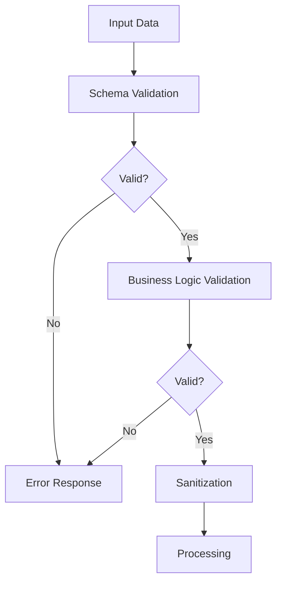

# Sistema de Validación

## Visión General

El sistema de validación de Split Sheet Backend garantiza que todos los datos que ingresan a la aplicación sean correctos, completos y seguros. Utiliza múltiples capas de validación para prevenir errores y proteger contra ataques maliciosos.

## Arquitectura de Validación



## Componentes de Validación

### 1. Validación de Esquema (Marshmallow)

La primera capa de validación utiliza schemas de Marshmallow para verificar tipos, formatos y restricciones básicas:

```python
class RegisterSchema(Schema):
    username = fields.Str(required=True, validate=[
        validate.Length(min=3, max=50),
        validate.Regexp(r'^[a-zA-Z0-9_]+$', error='Solo letras, números y guiones bajos')
    ])
    password = fields.Str(required=True, validate=validate.Length(min=8))
    email = fields.Email(required=True)
```

Implementación en endpoints:

```python
@bp.route('/register', methods=['POST'])
def register():
    try:
        # Validar datos con schema
        schema = RegisterSchema()
        data = schema.load(request.get_json())
        
        # Procesar datos validados
        # ...
        
    except ValidationError as err:
        return jsonify({"error": "Datos inválidos", "details": err.messages}), 400
```

### 2. Validación de Datos Específica del Dominio

Después de la validación de esquema, se aplican reglas de negocio específicas:

```python
def validate_business_rules(data):
    """Validación específica del dominio."""
    errors = {}
    
    # Verificar que el username no exista
    if User.query.filter_by(username=data['username']).first():
        errors['username'] = ["El nombre de usuario ya existe"]
    
    # Verificar que el email no exista
    if User.query.filter_by(email=data['email']).first():
        errors['email'] = ["El email ya está registrado"]
    
    # Verificar contraseña segura
    if not is_password_strong(data['password']):
        errors['password'] = ["La contraseña no cumple los requisitos de seguridad"]
    
    return errors
```

### 3. Sanitización de Datos

Después de validar, los datos se sanitizan para eliminar contenido potencialmente peligroso:

```python
def sanitize_input(data):
    """Sanitiza datos de entrada para prevenir XSS y otras vulnerabilidades."""
    if isinstance(data, dict):
        return {k: sanitize_input(v) for k, v in data.items()}
    elif isinstance(data, str):
        # Usar biblioteca bleach para limpiar HTML y scripts
        return bleach.clean(data, strip=True)
    elif isinstance(data, list):
        return [sanitize_input(item) for item in data]
    else:
        return data
```

## Patrones de Validación en la API

### Flujo de Validación Estándar

```python
@bp.route('/endpoint', methods=['POST'])
def endpoint():
    # 1. Recibir y verificar datos JSON
    data = request.get_json(silent=True)
    if not data:
        return jsonify({"error": "Datos inválidos", "details": "No se recibieron datos JSON"}), 400
    
    # 2. Validar esquema con Marshmallow
    try:
        schema = MySchema()
        validated_data = schema.load(data)
    except ValidationError as err:
        return jsonify({"error": "Datos inválidos", "details": err.messages}), 400
    
    # 3. Validar reglas de negocio
    business_errors = validate_business_rules(validated_data)
    if business_errors:
        return jsonify({"error": "Datos inválidos", "details": business_errors}), 400
    
    # 4. Sanitizar datos
    clean_data = sanitize_input(validated_data)
    
    # 5. Procesar datos validados y sanitizados
    # ...
    
    return jsonify({"status": "success", "data": response_data})
```

### Middleware de Validación JWT

Para endpoints protegidos, se utiliza un middleware de JWT que valida automáticamente los tokens:

```python
@jwt.invalid_token_loader
def invalid_token_callback(error_string):
    """Personalización de respuesta para tokens inválidos."""
    return jsonify({
        'error': 'Token inválido',
        'details': error_string
    }), 401
```

## Validación en Generación de PDF

El proceso de generación de PDF implementa validaciones específicas:

```python
@bp.route('/pdf/generate_pdf', methods=['POST'])
@jwt_required()
def generate_pdf():
    """Genera un PDF con los datos proporcionados."""
    # Validación de datos
    data = request.get_json(silent=True)
    if not data:
        return jsonify({
            "error": "Datos inválidos", 
            "details": "No se recibieron datos JSON"
        }), 400
    
    # Validar campos requeridos
    required_fields = ['title', 'participants', 'metadata']
    missing_fields = [field for field in required_fields if field not in data]
    if missing_fields:
        return jsonify({
            "error": "Datos inválidos", 
            "details": f"Faltan campos requeridos: {', '.join(missing_fields)}"
        }), 400
    
    # Validar estructura de participantes
    for idx, participant in enumerate(data.get('participants', [])):
        if not all(k in participant for k in ['name', 'role', 'share']):
            return jsonify({
                "error": "Datos inválidos", 
                "details": f"Participante {idx+1} tiene campos faltantes"
            }), 400
        
        # Validar porcentaje
        try:
            share = float(participant['share'])
            if share <= 0 or share > 100:
                return jsonify({
                    "error": "Datos inválidos", 
                    "details": f"Porcentaje inválido para {participant['name']}"
                }), 400
        except (ValueError, TypeError):
            return jsonify({
                "error": "Datos inválidos", 
                "details": f"Porcentaje debe ser un número para {participant['name']}"
            }), 400
    
    # Validar suma total = 100%
    total_share = sum(float(p['share']) for p in data.get('participants', []))
    if abs(total_share - 100.0) > 0.01:  # Permitir pequeña tolerancia por errores de punto flotante
        return jsonify({
            "error": "Datos inválidos", 
            "details": f"La suma de porcentajes debe ser 100% (actual: {total_share}%)"
        }), 400
    
    # Continuar con la generación del PDF
    # ...
```

## Validación en Integración DocuSign

### Validación PKCE

El flujo OAuth 2.0 con PKCE incluye múltiples validaciones:

```python
@classmethod
def validate_verifier(cls):
    """Valida que el code_verifier exista y no haya expirado."""
    verifier = session.get(cls.CODE_VERIFIER_KEY)
    if not verifier:
        return False, "No hay code_verifier en sesión"
    
    timestamp = session.get(cls.CODE_VERIFIER_TIMESTAMP_KEY)
    if not timestamp:
        return False, "No hay timestamp para code_verifier"
    
    now = int(time.time())
    age = now - timestamp
    if age > cls.VERIFIER_EXPIRATION:
        return False, f"Code verifier expirado ({age} segundos)"
    
    return True, None
```

### Validación de Firma HMAC

Para webhooks de DocuSign, se implementa una validación HMAC:

```python
def validate_hmac_signature(request, hmac_key):
    """
    Valida la firma HMAC de una solicitud webhook de DocuSign.
    
    Args:
        request: Objeto request de Flask
        hmac_key: Clave secreta HMAC
        
    Returns:
        bool: True si la firma es válida
    """
    signature = request.headers.get('X-DocuSign-Signature-1')
    if not signature:
        return False
    
    body = request.get_data()
    
    # Calcular HMAC-SHA256
    expected_hmac = hmac.new(
        hmac_key.encode(),
        body,
        hashlib.sha256
    ).digest()
    
    # Comparación segura para prevenir timing attacks
    try:
        received_hmac = base64.b64decode(signature)
        return hmac.compare_digest(expected_hmac, received_hmac)
    except Exception:
        return False
```

## Respuestas de Error Estandarizadas

Para mantener consistencia, todas las respuestas de error siguen un formato estándar:

```json
{
    "error": "Breve descripción del error",
    "details": "Información detallada o campos específicos con problemas"
}
```

Implementación:

```python
def create_error_response(message, details=None, status_code=400):
    """
    Crea una respuesta de error estandarizada.
    
    Args:
        message: Mensaje principal de error
        details: Detalles adicionales (opcional)
        status_code: Código HTTP de respuesta
        
    Returns:
        Response: Respuesta JSON con el error
    """
    response = {
        "error": message
    }
    
    if details:
        response["details"] = details
        
    return jsonify(response), status_code
```

## Validación CSRF

Para protección CSRF en el flujo OAuth:

```python
@classmethod
def validate_state(cls, received_state):
    """
    Valida el parámetro state para prevenir ataques CSRF.
    
    Args:
        received_state: Estado recibido en la respuesta OAuth
        
    Returns:
        tuple: (is_valid, error_message)
    """
    stored_state = session.get(cls.STATE_KEY)
    
    if not stored_state:
        return False, "No hay state en sesión"
    
    if stored_state != received_state:
        return False, "El state no coincide"
    
    return True, None
```

## Logging de Errores de Validación

Los errores de validación se registran de manera consistente:

```python
def log_validation_error(endpoint, error_type, data=None, user_id=None):
    """
    Registra errores de validación para análisis.
    
    Args:
        endpoint: Ruta donde ocurrió el error
        error_type: Tipo de error
        data: Datos que causaron el error (sanitizados)
        user_id: ID del usuario (si está autenticado)
    """
    # Sanitizar datos sensibles
    safe_data = None
    if data:
        safe_data = sanitize_for_logging(data)
    
    current_app.logger.warning(
        f"Validation error in {endpoint}: {error_type} | "
        f"User: {user_id or 'anonymous'} | "
        f"IP: {request.remote_addr} | "
        f"Data: {safe_data}"
    )
```

## Referencias y Recursos

- [Marshmallow Documentación](https://marshmallow.readthedocs.io/)
- [Bleach para Sanitización](https://github.com/mozilla/bleach)
- [OWASP Input Validation Cheat Sheet](https://cheatsheetseries.owasp.org/cheatsheets/Input_Validation_Cheat_Sheet.html)
